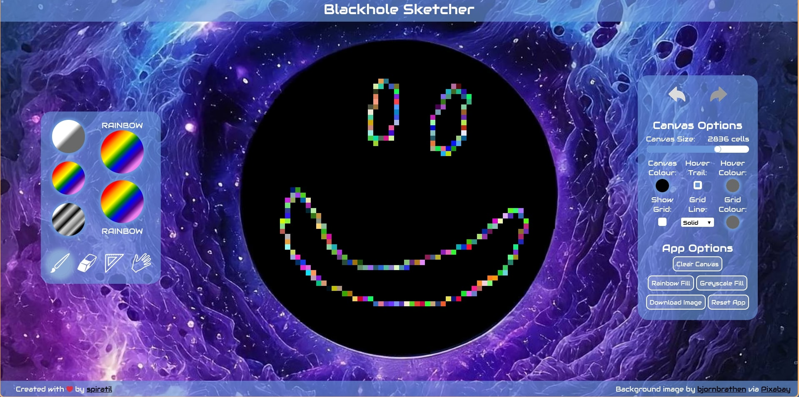

# Blackhole Sketcher
Welcome to the Blackhole Sketcher - A simple paint tool that runs inside your browser.

## Features
### Tools:
- Draw/Paint
- Erase
- Line
- Move

### Functionality:
- Undo/Redo actions
- Adjust the canvas resolution
- Canvas adjustments, (colour, hover trail)
- Customisable grid lines, (colour, line type)
- Rainbow and greyscale fill modes
- Download your creation with the blackhole as part of your sketch

## Motivation
This app was created as part of the learning curriculum in [The Odin Project](https://www.theodinproject.com/).

The app runs entirely from your browser using JavaScript. Spiratil has experience coding in JavaScript but wanted to push themselves further for this project.

## License
The Blackhole Sketcher has been released under the Creative Commons CC-1.0. You are free to copy, modify and use this repository as you like.

The background image was created by [bjornbrathen](https://pixabay.com/users/bjornbrathen-557716/).

